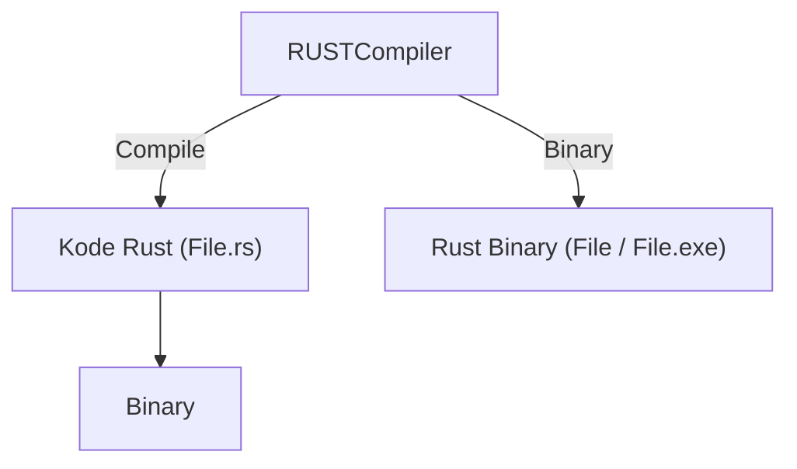

### Index

<ul>
  <li><a href="#ekosistem">Ekosistem</a></li>
  <li><a href="#instalasi">Instalasi</a></li>
  <li><a href="#new_project">New Project</a></li>
  <li><a href="#main_function">Main Function</a></li>
</ul>

<br>
<br>
<br>

# Rust

2006 - Graydon Hoare
Rilis Public - 2015

Keunggulan :

- Keamanan Memori
- Kinerja Tinggi, Hampir setara bahasa induk (C/C++)
- Pemeliharaan kode yang baik,
- Concurrency yang Aman

<div align="right">
  <a href="https://www.rust-lang.org/">Rust book</a>
</div>

---

<br>
<br>
<br>

<span id="ekosistem"></span>

## Ekosistem Rust



<div align="right">
  <a href="https://github.blog/2023-11-08-the-state-of-open-source-and-ai">Rust</a>
</div>

---

<br>
<br>
<br>

<span id="instalasi"></span>

## Instalasi Rust

1.  install `Rustup`
    - Linux/MacOS

        ```bash
        curl --proto '=https' --tlsv1.2 https://sh.rustup.rs -sSf | sh
        ```

        > pastikan untuk sudah mempunyai compiler C untuk bisa menjalankan Rust,
        > untuk Pengguna linux seperti `GCC` atau `Clang`, dan untuk MacOS `xcode-select --install`-

    - Windows. <br>
      buka link instalasi dan ikuti petunjuk untuk yang sudah di sediakan.

2.  periksa instalasi: `rustc --version`.
3.  memperbarui dan menghapus instalasi.
    - Update : `rustup update`
    - Uninstall : `rustup self uninstall`

4.  untuk develpment offline.
    - setelah menginstall rust dan ingin bisa menjalankan tanpa koneksi internet.

        ```bash
        cargo new get-dependencies
        cd get-dependencies
        cargo add rand@0.8.5 trpl@0.2.0
        ```

<div align="right">
  <a href="https://www.rust-lang.org/tools/install">Link instalasi</a>
</div>

---

<br>
<br>
<br>

<span id="new_project"></span>

## New Project

- buat project baru:

```
cargo new <Project name>
```

- Akan mucul folder baru:

```
new-project/
├── Cargo.toml
└── src
    └── main.rs

2 directories, 2 files
```

- extension rust adalah `.rs`
- file utama rust adalah main.rs

### Hello World

- pertama kali dibuat, akan menampilkan project default berupa output Hello world

```rs
fn main() {
    println!("Hello, world!");
}
```

- untuk menjalankannya, cukup jalankan perintah:

```bash
rustc main.rs
./main
```

> Akan menghasilkan Output: `Hello, world!`

---

<br>
<br>
<br>

<span id="main_function"></span>

## Main function

- deklarasi fungsi di rust menggunakan `fn`

```rs
fn main () {}
fn submain () {}
```

---

<br>
<br>
<br>

## Print Macro!

- terdapat 2 metode print, yaitu

1. `print!()` - untuk menulis
2. `println!()` - menulis dan diakhiri dengan \n(newline)
3. `!` macro -

## Cargo

- Cargo merupakan package Manager milik rust
- Dengan Cargo bisa melakukan Compilasi, depedency management, dll
- berbeda denga Java, PHP, C/C++ yang tidak memiliki package manager bawaan.

## Menjalankan Project

- dengan Cargo:

```bash
cargo run
```

## Membuat distribution file

- Distribution file adalah file hasil akhir akhir Project yang nanti akan dijalankan sebagai Aplikasi
- untuk membuat Distribution File:

```
Cargo build --release
```

- `--release` : file binarynya akan tersimpan di `target/release/project.exe`

## Unit Test

- didalam rust, satu Project hanya bisa pakai satu main function
- alternatif lain adalah dengan menggunakan Unit Test

https://youtu.be/FkASrE05VY4?si=EJtv0kiWWfcID1Qr
