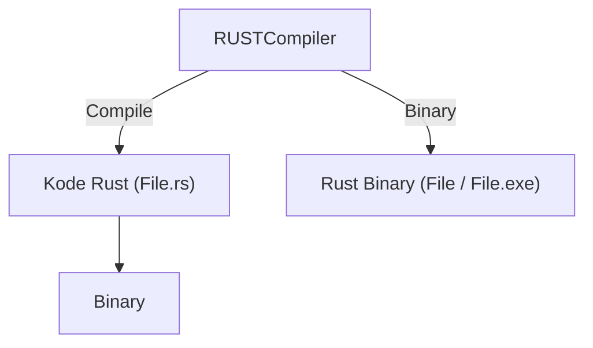

### Index

  <ul>
    <li><a href="#ekosistem">Ekosistem</a></li>
    <li><a href="#instalasi">Instalasi</a></li>
    <li><a href="#new_project">New Project</a></li>
    <li><a href="#main_function">Main Function</a></li>
    <li><a href="#kompilasi">Kompilasi dan Eksekusi</a></li>
  </ul>

  <br>
  <br>
  <br>

# Rust

2006 - Graydon Hoare
Rilis Public - 2015

Keunggulan :

- Keamanan Memori
- Kinerja Tinggi, Hampir setara bahasa induk (C/C++)
- Pemeliharaan kode yang baik,
- Concurrency yang Aman

<div align="right">
  <a href="https://www.rust-lang.org/">Rust book</a>
</div>

---

  <br>
  <br>
  <br>

<span id="ekosistem"></span>

## Ekosistem Rust



  <div align="right">
    <a href="https://github.blog/2023-11-08-the-state-of-open-source-and-ai">Rust</a>
  </div>

---

  <br>
  <br>
  <br>

<span id="instalasi"></span>

## Instalasi Rust

1.  install `Rustup`
    - Linux/MacOS

        ```bash
        curl --proto '=https' --tlsv1.2 https://sh.rustup.rs -sSf | sh
        ```

        > pastikan untuk sudah mempunyai compiler C untuk bisa menjalankan Rust,
        > untuk Pengguna linux seperti `GCC` atau `Clang`, dan untuk MacOS `xcode-select --install`-

    - Windows. <br>
      buka link instalasi dan ikuti petunjuk untuk yang sudah di sediakan.

2.  periksa instalasi: `rustc --version`.
3.  memperbarui dan menghapus instalasi.
    - Update : `rustup update`
    - Uninstall : `rustup self uninstall`

4.  untuk develpment offline.
    - setelah menginstall rust dan ingin bisa menjalankan tanpa koneksi internet.

        ```bash
        cargo new get-dependencies
        cd get-dependencies
        cargo add rand@0.8.5 trpl@0.2.0
        ```

  <div align="right">
    <a href="https://www.rust-lang.org/tools/install">Link instalasi</a>
  </div>

---

  <br>
  <br>
  <br>

<span id="new_project"></span>

## New Project

- buat project baru:

```
cargo new <Project name>
```

- Akan mucul folder baru:

```
new-project/
├── Cargo.toml
└── src
    └── main.rs

2 directories, 2 files
```

- extension rust adalah `.rs`
- file utama rust adalah main.rs

### Hello World

- pertama kali dibuat, akan menampilkan project default berupa output Hello world

```rs
fn main() {
    println!("Hello, world!");
}
```

- untuk menjalankannya, cukup jalankan perintah:

```bash
rustc main.rs
./main
```

> Akan menghasilkan Output: `Hello, world!`

---

  <br>
  <br>
  <br>

<span id="main_function"></span>

## Main Function

Setiap Project rust itu memiliki satu fungsi utama yang disebut Main.
fn main() adalah kode utama yang pertama dijalankan dalam setiap prgram Rust.

```rs
fn main() {
  println!("Hello There!!");
}

```

---

<br>
<br>
<br>

<span id="kompilasi"></span>

## Kompilasi & Eksekusi

- cukup menjalankan rustc pada file main.rs dengan kompiler yang tersedia di satu environtment/perangkat.
- dan setelah menghasilkan file binary './main'. maka file itu bisa dijalankan oleh siapa saja bahkan yang tidakmemiliki depedensi Rust di lingkungannya.

1. `cargo new` : Untuk membuat project baru,
    - project default `Hello World`

    ```bash
    project_new/
    ├── Cargo.toml
    └── src
        └── main.rs

    2 directories, 2 files
    ```

2. `cargo run` : untuk mengetes/menjalankan aplikasi saat proses development.
    - project binary sementara yang tersimpan di `/project_new/target/debug/project_new`

3. `cargo build` : untuk membuild hasil akhir kode program menjadi file binary.
    - `cargo build` dan `cargo run` hanya menghasilkan file binary yang _unoptimized_ dan berisi beberapa informasi tambahan untuk proses debugging. untuk file biarynya sama-sama tersimpan dalam `tager/debug`
    - untuk distribution dan/production dianjurkan untuk generate _optimized_ binary:
    ```bash
    cargo build --release
    ```
    file binarynya akan tersimpan di `/project_new/target/release/project_new`

---

<br>
<br>
<br>

<samp>

halo
there!

```rs
fn main() {
  let mut ganronpa = "social distancing";
  println!("{ganronpa}");

  ganronpa = "no way!";
  println!("{}", ganronpa);
}
```

Good by then

</samp>
