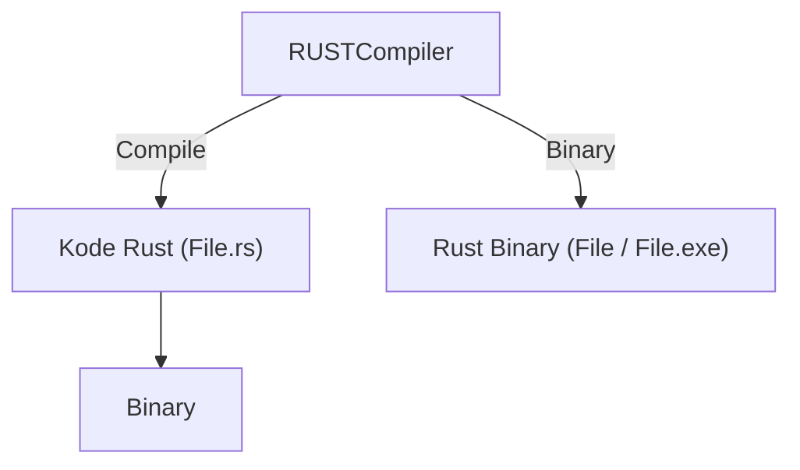

## Rust

https://www.rust-lang.org/

2006 - Graydon Hoare
Rilis Public - 2015

Keunggulan :

- Keamanan Memori
- Kinerja Tinggi, Hampir setara bahasa induk (C/C++)
- Pemeliharaan kode yang baik,
- Concurrency yang Aman

## Ekosistem Rust

https://github.blog/2023-11-08-the-state-of-open-source-and-ai/



## Instalasi Rust

https://www.rust-lang.org/tools/install

# Base Depedensi Rust:

- rustup

check :

```
rustup check
rustc --version
```

## New Project

- buat project baru:

```
cargo new <Project name>
```

- Akan mucul folder baru:

```
new-project/
├── Cargo.toml
└── src
    └── main.rs

2 directories, 2 files
```

- extension rust adalah `.rs`
- file utama rust dalah main.rs

## Hello World

- pertama kali dibuat, akan menampilkan project default berupa output Hello world

```rs
fn main() {
    println!("Hello, world!");
}
```

## Main function

- deklarasi fungsi di rust menggunakan `fn`

```rs
fn main () {}
fn submain () {}
```

## Print Macro!

- terdapat 2 metode print, yaitu

1. `print!()` - untuk menulis
2. `println!()` - menulis dan diakhiri dengan \n(newline)
3. `!` macro -

## Cargo

- Cargo merupakan package Manager milik rust
- Dengan Cargo bisa melakukan Compilasi, depedency management, dll
- berbeda denga Java, PHP, C/C++ yang tidak memiliki package manager bawaan.

## Menjalankan Project

- dengan Cargo:

```bash
cargo run
```

## Membuat distribution file

- Distribution file adalah file hasil akhir akhir Project yang nanti akan dijalankan sebagai Aplikasi
- untuk membuat Distribution File:

```
Cargo build --release
```

- `--release` : file binarynya akan tersimpan di `target/release/project.exe`

## Unit Test

- didalam rust, satu Project hanya bisa pakai satu main function
- alternatif lain adalah dengan menggunakan Unit Test

https://youtu.be/FkASrE05VY4?si=EJtv0kiWWfcID1Qr
